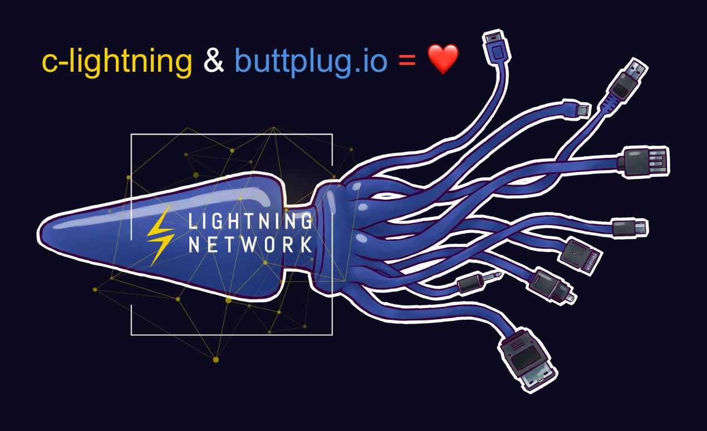

Buttplug for c-lightning
========================

This plugin for c-lightning makes your feel goo-o-ood whenever your node receives or routes a lightning payment. Configure it to use your favorite sex toy for notifications.



Installation
============

Clone this into `~/.lightning/plugins/` folder, make sure `buttplugin.py` is executable (set with `chmod +x buttplugin.py`)

Perfect companion to the [donation plugin](https://github.com/lightningd/plugins/tree/master/donations) - feel support of your community!

Excitement configuration
========================

By default every satoshi makes you happy, both for routing and receving payments.

Routing and direct payments can be configured independentl with 3 parameters:

- `min_amount=1sat` - you can feel even one satoshi
- `rate=10sat` - every 10 satoshi will cause increase in the vibration intensity
- `pattern=519` - set different patterns to feel routing and receiving differently. `519` here means that the toy will vibrate 3 times per payment, digits `5`, `1` and `9` mean relative amplitude.
- `max_vibro=255` - maximum amplitude for the toy. Decrease it if you feel too excited when large payments come through.

Pleasure testing
================

Check how it feels when you route a payment with 1 satoshi fee:

```sh
lightning-cli buttplug route 1
```

Same for invoice payment of 10000 satoshi:

```sh
lightning-cli buttplug payment 10000
```